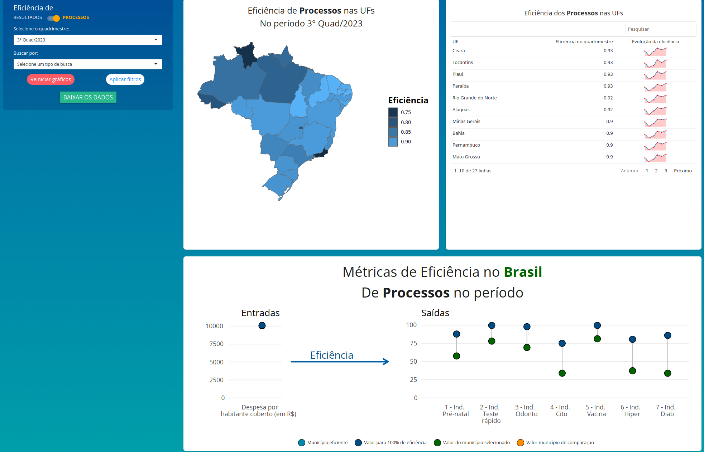

# Dashboard do projeto de Eficiência na APS

Este é o dashboard criado no projeto de eficiência da APS, utilizando a linguagem R e o pacote Shiny. O painel foi criado para facilitar a visualização dos dados e a tomada de decisão. Nós usamos a interatividade do Shiny para permitir que o usuário escolha quais dados ele deseja visualizar dentre as opções gráficas apresentadas, sendo elas, um mapa apresentando o valor da eficiência calculada, uma tabela para comparação com as demais localidades comparativas e um gráfico apresentando os valores para cada um dos fatores considerados como valores de entrada e saída no cálculo da eficiência. Os cálculos da eficiência foram feitos por município, dados de região de saúde e de UF serão dados médios entre os seus municípios.

## Tela do dashboard

## Instalação

Pré-requisitos:

-   R (utilizada versão 4.3.3)
-   RStudio (utilizada versão RStudio 2024.09.1+394 "Cranberry Hibiscus")
-   Pacotes necessários (DESCRIPTION para dependências)

## Como rodar o projeto

Após instalar as dependências, para rodar em modo de testes, é possível utilizar o comando `golem:::run_dev()` no console do RStudio, onde ele fará o carregamento dos pacotes e funções necessárias e irá rodar, por padrão na porta 4000. Para rodar em modo de produção, é possível utilizar o comando `Rscript app.R` na pasta raíz do projeto no console.

Caso alterações sejam feitas nos dados, é necessário que um novo pré-processamento de dados precise ser feito, para isso, os passos podem ser rodados na função `pre/pre-proc.R`\`.

## Estrutura do projeto

O projeto está estruturado em pastas, onde cada uma delas tem um propósito específico:

-   `data/`: Pasta onde estão os dados utilizados no dashboard, depois de transformados e tratados.
-   `data-raw/`: Pasta onde estão os dados originais, que foram recebidos de diversas fontes e compõe os dados base para construção do painel.
-   `dev`: Pasta onde estão os scripts do framework Golem para criação e desenvolvimento da aplicação (alterados conforme necessidade do projeto).
-   `inst/`: Pasta onde estão os arquivos de configuração, arquivos de estilo (css criados e bibliotecas css utilizadas) e demais funcionalidades web (scripts js criados e bibliotecas javascript utilizadas).
-   `man/`: Pasta onde estão algumas documentações de suporte para o uso da aplicação Shiny.
-   `R/`: Pasta onde estão os scripts de funções do dashboard, onde boa parte do código desenvolvido está.
